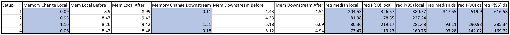
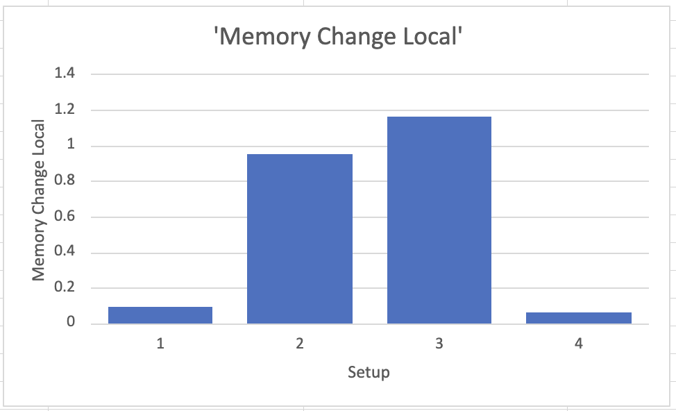
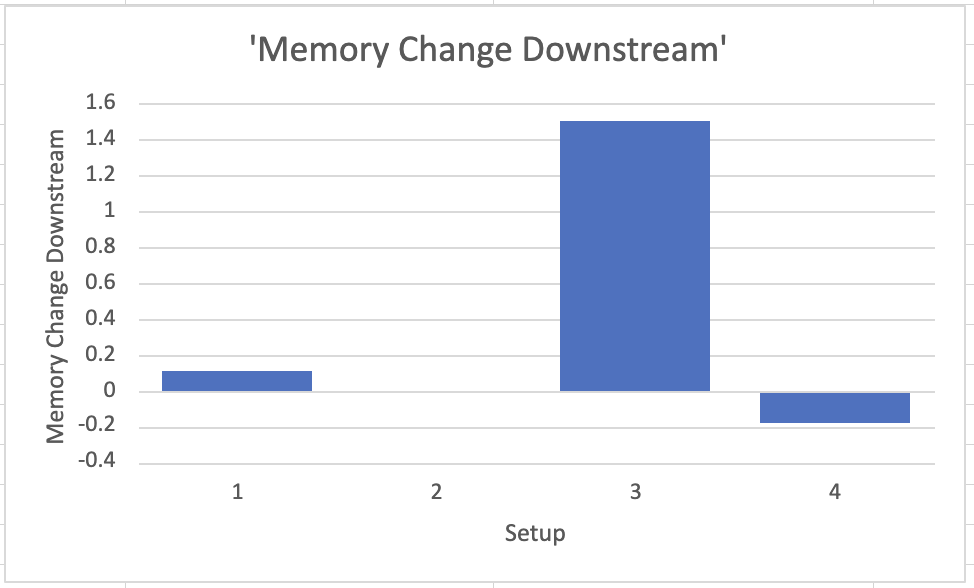

# 2023-10-02 - Steve and Vai tests

## Results

Under test conditions, according to collected measures described below:


## Hardware and infrastructure configuration outline

- rke local cluster
  - aws t3.xlarge
  - 50gb gp3 ebs storage
  - rke 1.25.12
- rke2 downstream cluster
  - aws t3a.xlarge
  - 16gb root disk size
  - v1.26.8-rke2r1

- k6 load generator running on a laptop

## Process outline

- infrastructure setup:
  - create an rke cluster, install Rancher v2.7.5 on it.
  - install monitoring on local
  - provision rke2 cluster via rancher
  - install monitoring on downstream
  - build patched Rancher images. There were 2 custom images built:
    * one based on a branch that modifies the steve cache https://github.com/rmweir/steve/tree/steve-cache. These modifications include:
      * caching entries prior to sorting and filtering, caching is done right after response is returned from proxy store
      * cache key modified to consider list options
      * cache key modified to no longer consider access key so users of differing rbac can use the same entries
      * cache is on by default
      * cache can be constrained by bytes and entries
    * one that further modifies the steve cache to track the latest resource version and return a cache entry when possible https://github.com/rmweir/steve/tree/steve-cache-rv-update
- for each test:
  - run script to generate a number of namespaces. Can use [20230927_steve_cache_test create ns script](https://github.com/rmweir/scalability-tests/tree/20230927_steve_cache_test/bash/create-ns.sh)
  - swap images with patched ones. To ensure proper agent image is used, set the environment variable `CATTLE_AGENT_IMAGE` in the rancher deployment
  - run load test script, record results

## Full configuration details

All infrastructure for local cluster is defined in [Terraform](https://www.terraform.io/) file in the [20230927_steve_cache_tests](https://github.com/rmweir/scalability-tests/tree/20230306_steve_vai_tests/terraform) branch.

[k6](https://k6.io) load test scripts are defined in the [k6](https://github.com/rmweir/scalability-tests/tree/20230927_steve_cache_tests/k6) directory.

## Reproduction Instructions

### Requirements

- docker
- [Terraform](https://www.terraform.io/downloads)
- rke v1.4.8
- `git`
- [k6](https://k6.io)

### Setup

Deploy the k3d infrastructure and install Rancher:
```shell
# clone this project
git clone https://github.com/rmweir/scalability-tests.git
cd scalability-tests
git checkout 20230927_steve_cache_tests

# initialize Terraform
cd terraform
terraform init

# deploy
terraform apply -auto-approve

# install docker
install docker on each node

# install rke
copy cluster.yml from [20230927_steve_cache_test create ns script](https://github.com/rmweir/scalability-tests/tree/20230927_steve_cache_test/rke/cluster.yml)

# install rancher
follow instructions from [rancher docs](https://ranchermanager.docs.rancher.com/pages-for-subheaders/install-upgrade-on-a-kubernetes-cluster) to install rancher with self-signed certs.


# Build patched images and upload them to your own repo:

```shell
# build Rancher from the [rmweir/steve-cache](https://github.com/rmweir/rancher/tree/steve-cache) branch
git clone https://github.com/rmweir/rancher.git
cd rancher
git checkout steve-cache

cat >scripts/quickbuild <<"EOF"
#!/bin/bash
set -e

cd $(dirname $0)

./build
./package
EOF
chmod +x scripts/quickbuild

TAG=steve-cache make quickbuild

# build Rancher again from the [rmweir/steve-cache-rv-update](https://github.com/rmweir/rancher/tree/steve-cache-rv-update) branch
git checkout steve-cache-rv-update
TAG=steve-cache-rv-update make quickbuild

# tag each image and push to your repo
`docker tag rancher/rancher:steve-cache <your-repo>/rancher:steve-cache`
`docker tag rancher/rancher:steve-cache-rv-update <your-repo>/rancher:steve-cache-rv-update`
`docker tag rancher/rancher-agent:steve-cache <your-repo>/rancher:steve-cache`
`docker tag rancher/rancher-agent:steve-cache-rv-update <your-repo>/rancher:steve-cache-rv-update`

# login and setup users
Configure Rancher and import the downstream cluster:
 - log in (https://upstream.local.gd:8443) with bootstrap password `admin`
 - create the admin user's password (eg. `<password>`)
 - create five users with the same prefix, such as: admin1, admin2, admin3, admin4, admin5 with the same <user-password> where user password is the same for all five users.
 - give each user the cluster role "administrator" and 1 unique custom role, like manage-catalogs.
 - give each user a unique project binding in the downstream cluster in the default project.


All created infrastructure can be destroyed at the end of the test via:
```shell
terraform destroy -auto-approve
```

### Benchmark setup 1: benchmark pagination implementations, interpret duration results

#### Outline
This first test will be our baseline. We will run the benchmark script against local and the downstream cluster. The image for rancher and the cattle-cluster-agent should be `rancher/rancher:v2.7.5`. The steve cache will be left disabled.

Then, we simulate 3 virtual users listing all namespaces. Each request uses a token for one of the 5 admin users. This is selected by random. Each user will repeat the listing 30 times (for statistical accuracy of measures). The page size is of 100, like in the current UI. We exercise both the k8s based pagination implementation, using the `limit`/`continue` parameters and currently used by the [dashboard](https://github.com/rancher/dashboard/) UI, as well as the new Steve-cache pagination implementation using the `page`/`pagesize` parameters. We test both local and downstream cluster.

#### Procedure

Run this command to benchmark. First we will benchmark requests from local.
```shell
 k6 run -e BASE_URL=<url> -e USERNAME_PREFIX=admin -e PASSWORD=<user-password> -e CLUSTER=local -e PAGINATION_STYLE=steve -e RESOURCE=namespaces --http-debug ./pagination-scale-test.js -e VUS=3 |& tee benchmark_output_`date +"%Y-%m-%d_%H-%M-%S"`.txt
```

Once the benchmark has finished, we will perform the benchmark on the downstream cluster. The id for the cluster should be of the form `c-m-xxxx`.
Run this command to swap Rancher and agent images to patched ones:
```shell
 k6 run -e BASE_URL=<url> -e USERNAME_PREFIX=admin -e PASSWORD=<user-password> -e CLUSTER=<c-m-xxxx> -e PAGINATION_STYLE=steve -e RESOURCE=namespaces --http-debug ./pagination-scale-test.js -e VUS=3 |& tee benchmark_output_`date +"%Y-%m-%d_%H-%M-%S"`.txt
```

### Benchmark setup 2: benchmark pagination implementations, interpret duration results

#### Outline
This second test will be our with the steve cache enabled. We will run the benchmark script against local and the downstream cluster. The image for rancher and the cattle-cluster-agent should be `rancher/rancher:v2.7.5`. The steve cache will be left disabled. 

Then, we simulate 3 virtual users listing all namespaces. Each request uses a token for one of the 5 admin users. This is selected by random. Each user will repeat the listing 30 times (for statistical accuracy of measures). The page size is of 100, like in the current UI. We exercise both the k8s based pagination implementation, using the `limit`/`continue` parameters and currently used by the [dashboard](https://github.com/rancher/dashboard/) UI, as well as the new Steve-cache pagination implementation using the `page`/`pagesize` parameters. We test both local and downstream cluster.

#### Procedure
Edit rancher deployment to have the following environment variable(s) set:
`CATTLE_REQUEST_CACHE_DISABLED="false"`
`CATTLE_REQUEST_CACHE_SIZE_INT=99999`

Run this command to benchmark. First we will benchmark requests from local.
```shell
 k6 run -e BASE_URL=<url> -e USERNAME_PREFIX=admin -e PASSWORD=<user-password> -e CLUSTER=local -e PAGINATION_STYLE=steve -e RESOURCE=namespaces --http-debug ./pagination-scale-test.js -e VUS=3 |& tee benchmark_output_`date +"%Y-%m-%d_%H-%M-%S"`.txt
```

Once the benchmark has finished, we will perform the benchmark on the downstream cluster. The id for the cluster should be of the form `c-m-xxxx`.
Run this command to swap Rancher and agent images to patched ones:
```shell
 k6 run -e BASE_URL=<url> -e USERNAME_PREFIX=admin -e PASSWORD=<user-password> -e CLUSTER=<c-m-xxxx> -e PAGINATION_STYLE=steve -e RESOURCE=namespaces --http-debug ./pagination-scale-test.js -e VUS=3 |& tee benchmark_output_`date +"%Y-%m-%d_%H-%M-%S"`.txt
```

### Benchmark setup 2: benchmark pagination implementations

#### Outline
This second test will be our with the steve cache enabled. We will run the benchmark script against local and the downstream cluster. The image for rancher and the cattle-cluster-agent should be `rancher/rancher:v2.7.5`. 

Then, we simulate 3 virtual users listing all namespaces. Each request uses a token for one of the 5 admin users. This is selected by random. Each user will repeat the listing 30 times (for statistical accuracy of measures). The page size is of 100, like in the current UI. We exercise both the k8s based pagination implementation, using the `limit`/`continue` parameters and currently used by the [dashboard](https://github.com/rancher/dashboard/) UI, as well as the new Steve-cache pagination implementation using the `page`/`pagesize` parameters. We test both local and downstream cluster.

#### Procedure
Edit rancher deployment to have the following environment variable(s) set:
`CATTLE_REQUEST_CACHE_DISABLED="false"`
`CATTLE_REQUEST_CACHE_SIZE_INT=99999`

Run this command to benchmark. First we will benchmark requests from local.
```shell
 k6 run -e BASE_URL=<url> -e USERNAME_PREFIX=admin -e PASSWORD=<user-password> -e CLUSTER=local -e PAGINATION_STYLE=steve -e RESOURCE=namespaces --http-debug ./pagination-scale-test.js -e VUS=3 |& tee benchmark_output_`date +"%Y-%m-%d_%H-%M-%S"`.txt
```

Once the benchmark has finished, we will perform the benchmark on the downstream cluster. The id for the cluster should be of the form `c-m-xxxx`.
Run this command to swap Rancher and agent images to patched ones:
```shell
 k6 run -e BASE_URL=<url> -e USERNAME_PREFIX=admin -e PASSWORD=<user-password> -e CLUSTER=<c-m-xxxx> -e PAGINATION_STYLE=steve -e RESOURCE=namespaces --http-debug ./pagination-scale-test.js -e VUS=3 |& tee benchmark_output_`date +"%Y-%m-%d_%H-%M-%S"`.txt
```

### Benchmark setup 3: benchmark revised cache

#### Outline
This fourth test will be for the branch that uses the revised cache. The cache is enabled by default in this image We will run the benchmark script against local and the downstream cluster. The image for rancher and the cattle-cluster-agent should be `<your-repo>/rancher:steve-cache`. The steve cache will be left disabled. 

Then, we simulate 3 virtual users listing all namespaces. Each request uses a token for one of the 5 admin users. This is selected by random. Each user will repeat the listing 30 times (for statistical accuracy of measures). The page size is of 100, like in the current UI. We exercise both the k8s based pagination implementation, using the `limit`/`continue` parameters and currently used by the [dashboard](https://github.com/rancher/dashboard/) UI, as well as the new Steve-cache pagination implementation using the `page`/`pagesize` parameters. We test both local and downstream cluster.

#### Procedure
Edit rancher deployment to have the following environment variable(s) set:
`CATTLE_STEVE_CACHE_LIMIT_BYTES="99999999999"`
`CATTLE_STEVE_CACHE_LIMIT_ELEMENTS="99999"`
`CATTLE_AGENT_IMAGE="<your-repo>/rancher-agent:steve-cache"`

Edit rancher deployment to use the following image in the rancher pod:
`<your-repo>/rancher:steve-cache`

Run this command to benchmark. First we will benchmark requests from local.
```shell
 k6 run -e BASE_URL=<url> -e USERNAME_PREFIX=admin -e PASSWORD=<user-password> -e CLUSTER=local -e PAGINATION_STYLE=steve -e RESOURCE=namespaces --http-debug ./pagination-scale-test.js -e VUS=3 |& tee benchmark_output_`date +"%Y-%m-%d_%H-%M-%S"`.txt
```

Once the benchmark has finished, we will perform the benchmark on the downstream cluster. The id for the cluster should be of the form `c-m-xxxx`.
Run this command to swap Rancher and agent images to patched ones:
```shell
 k6 run -e BASE_URL=<url> -e USERNAME_PREFIX=admin -e PASSWORD=<user-password> -e CLUSTER=<c-m-xxxx> -e PAGINATION_STYLE=steve -e RESOURCE=namespaces --http-debug ./pagination-scale-test.js -e VUS=3 |& tee benchmark_output_`date +"%Y-%m-%d_%H-%M-%S"`.txt
```

### Benchmark setup 4: benchmark revised cache with resource version monitoring

#### Outline
This fourth test will be for the branch that uses the revised cache and monitors the latest resource version.. The cache is enabled by default in this image. We will run the benchmark script against local and the downstream cluster. The image for rancher and the cattle-cluster-agent should be `<your-repo>/rancher:steve-cache`. The steve cache will be left disabled. 

Then, we simulate 3 virtual users listing all namespaces. Each request uses a token for one of the 5 admin users. This is selected by random. Each user will repeat the listing 30 times (for statistical accuracy of measures). The page size is of 100, like in the current UI. We exercise both the k8s based pagination implementation, using the `limit`/`continue` parameters and currently used by the [dashboard](https://github.com/rancher/dashboard/) UI, as well as the new Steve-cache pagination implementation using the `page`/`pagesize` parameters. We test both local and downstream cluster.

#### Procedure
Edit rancher deployment to have the following environment variable(s) set:
`CATTLE_STEVE_CACHE_LIMIT_BYTES="99999999999"`
`CATTLE_STEVE_CACHE_LIMIT_ELEMENTS="99999"`
`CATTLE_AGENT_IMAGE="<your-repo>/rancher-agent:steve-cache-rv-update"`

Edit rancher deployment to use the following image in the rancher pod:
`<your-repo>/rancher:steve-cache-rv-update`

Run this command to benchmark. First we will benchmark requests from local.
```shell
 k6 run -e BASE_URL=<url> -e USERNAME_PREFIX=admin -e PASSWORD=<user-password> -e CLUSTER=local -e PAGINATION_STYLE=steve -e RESOURCE=namespaces --http-debug ./pagination-scale-test.js -e VUS=3 |& tee benchmark_output_`date +"%Y-%m-%d_%H-%M-%S"`.txt
```

Once the benchmark has finished, we will perform the benchmark on the downstream cluster. The id for the cluster should be of the form `c-m-xxxx`.
Run this command to swap Rancher and agent images to patched ones:
```shell
 k6 run -e BASE_URL=<url> -e USERNAME_PREFIX=admin -e PASSWORD=<user-password> -e CLUSTER=<c-m-xxxx> -e PAGINATION_STYLE=steve -e RESOURCE=namespaces --http-debug ./pagination-scale-test.js -e VUS=3 |& tee benchmark_output_`date +"%Y-%m-%d_%H-%M-%S"`.txt
```


Interpreting results: k6 will output several values. For this analysis most interesting are `http_req_duration` metric statistics:
```
     http_req_duration..............: avg=98.7ms   min=10.79ms  med=94.62ms  max=284.48ms p(95)=175.11ms p(99)=210.48ms count=901
```
In the example above, retrieving a page up to 100 resources from the local cluster took **98.7ms** on average - 10.79ms best case, 94.62ms median case (~50% of samples fell below this number and ~50% above), 284.48ms worst case. p(95) indicates that 95% of requests took less than 175.11ms, and p(99) indicates that 99% took 210.48ms or less. In general, lower values are better.

#### Analysis of results

Full results are available in the [20230306 - steve vai test results](https://github.com/rmweir/scalability-tests/tree/20230927_steve_cache_tests/docs/20230927%20-%20steve%20cache%20multi%20user%20tests) directory, summary is in the table below:



Observations:
- steve caching currently has an concurrent map/write bug that is prevalent when running in the agent
  - were unable to extract results from setup2 after multiple (3) attempts
- setups 2 and 3 are memory hungry
- setup 4 uses much less memory than 2 and 3
- caching speeds up requests across the board
- did encounter k6 error upon initial attempt to benchmark setup4
- setup 1 appears capable of pagination. It at least fulfills the request without an error

#### Analysis of results

Memory change for setups before benchmarking and after benchmarking finished:

When benchmarking local:


When benchmarking downstream:


Observations:
- caching approaches in setups 2 and 3 used >10x the amount of memory as not caching (setup 1) and the caching approach in setup4

## Follow-up notes

Results above indicate setup4, which uses an  implementation of the cache that monitors the latest resource version, is very promising. So far, the tests have not been varied, as it focused on comparing multiple setups. It would be a good idea to see how setup4 performs against setup1 in different scenarios, such as:
* different resources and different types
  * we should see how it performs on lists that do change often, i.e. configmaps
  * resources that contain larger bodies, i.e. configmaps and secrets
* higher counts of resources

More benchmarking is necessary to know if setup4 can outperform the other 3 setups in regards to response time in various scenarios. However, due to implementation details it can be concluded within reason that it uses substantially less memory than the other in memory cache implementations.

There appeared to be some odd behavior, potentially a bug, on the first run of setup4. Further testing should lead to more material around this bug to help with investigating and fixing it.

Other tests used 10 VUs while the ones above used 3. In the future we should try 10 as well for more comparable results.
